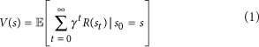
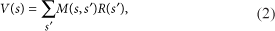
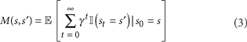
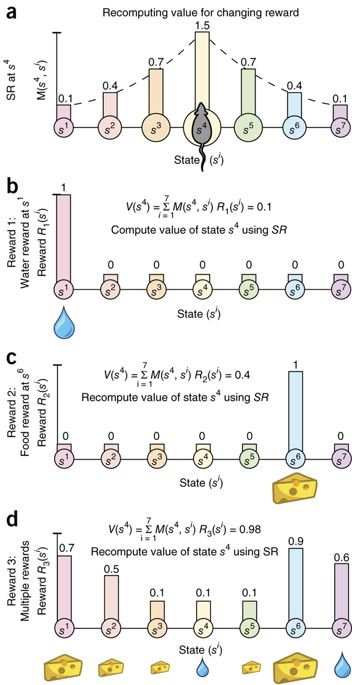
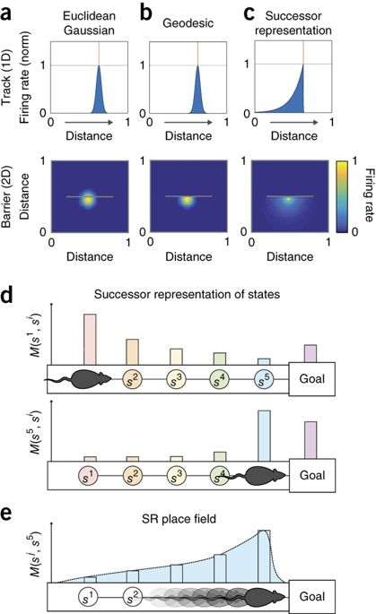
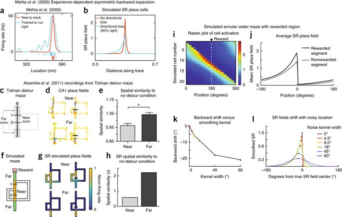
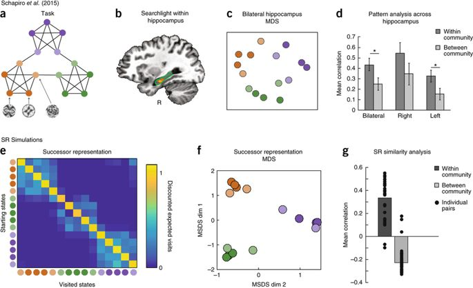
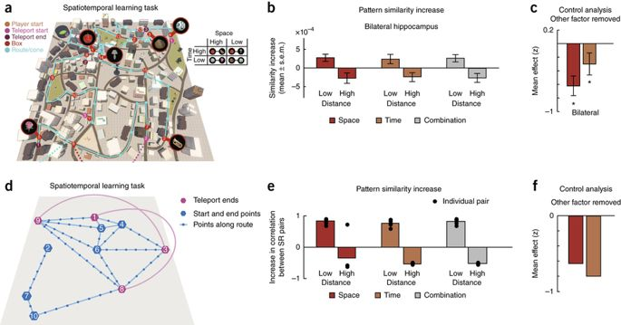
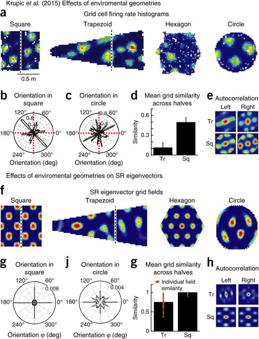
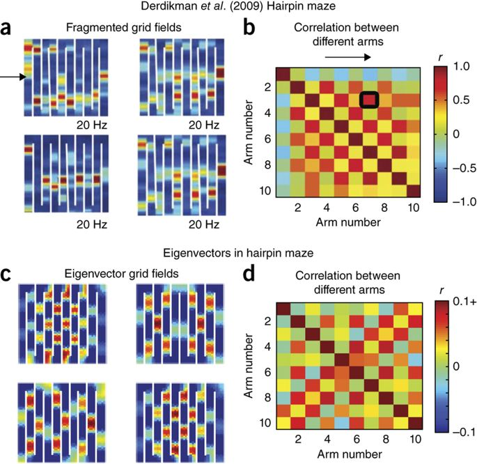

## The Hippocampus as a Predictive Map

Kimberly L. Stachenfeld, Matthew M. Botvinick & Samuel J. Gershman

 

 

### Abstract

- 해마의 주요 기능은 cognitive map을 만드는 것
  - 이때 place cells이 공간의 기하학적 표상을 부호화
  - John O’Keefe, The Hippocampus as a cognitive map, 1978
    <http://www.cognitivemap.net/> 

- 하지만 predictive coding, reward sensitivity, policy dependence in place cells와 같은 연구 결과들을 보면 그 표상이 순수하게 공간만을 나타내는 것은 아닌 것 같음

- 우리는 강화학습 관점에서 이 퍼즐을 풀고자 함
  - 즉, 어떤 종류의 공간 표상이 future reward를 최대화하는데 가장 유용한가?

- 연구 결과는 predictive representation의 형태가 그 해답임을 나타냄
  - predictive representation이 저거 다 설명할 수 있음

- 또한, entorhinal grid cells가 predictive representation을 위해 저차원의 기저집합을 부호화한다고 생각하는데, 이러한 기작은 예측 과정에서 생기는 노이즈를 억제하고, 계층적 플래닝을 위한 멀티 스케일 구조를 추출할 때 유용함

### Backgrounds

- 브레인은 진화 과정에서 다양한 강화학습 솔루션을 갖추게 되었을 것이다

  - Model-based solution
    - 환경의 cognitive map 또는 모델을 학습
    - future states 시뮬레이션을 통해 long-term reward를 예측
    - computationally intensive!
  - Model-free solution
    - trial-and-error를 통해 value function을 학습
    - 그런데 환경이 너무나 다이나믹함

- 그래서 우리는 세번째 솔루션을 생각해봤어

  - learning of a predictive map that represents each state in terms of its successor states

    - 참고: Peter Dayan, “Improving generalization for temporal difference learning: the successor representation”, Neural Computation, 5:613-624, 1993.

  - 동물이 특정 위치를 점유하고 있을 때 hippocampal place cells (PC)의 computational function을 일단 보면 되겠지?

    - 기존에는 Explicit map of space을 model-based나 model-free RL 시스템에 바로 적용했음
    - Predictive map 이론은 PC의 역할이 future states 예측값을 인코딩하는 것이라고 보는데, 그러고나서 value를 계산하기 위해 reward predictions랑 combined 된다고 함.
    - 이 이론을 통해 그간 설명되지 못했던 PC 관련 다양한 기작을 설명 가능함.

 

### Successor Representation (SR)

- Successor representation (SR) 모델은 간단히 말하면, PC가 장소를 그대로 인코딩하는게 아니라, 현재 state가 주어졌을 때 미래 states를 예측하는 표상을 인코딩한다는 것임.

- 조금만 구체적으로 보자

  - 강화학습에서는 일반적으로 현재 state에 대한 value를 미래에 주어질 모든 보상의 감가합(Expected discounted reward, c.f. temporal difference learning)으로 정의함 --> Eq. 1
  
  

  - Eq. 1은 reward func과 predictive representation of the state (i.e. SR)의 내적으로 decompose 가능 --> Eq. 2
  
  

  - SR은 current state에서 이동 가능한 경로(Eq. 3에서 Ⅱ 함수로 검사)에 포함되는 future states들을 인코딩함 --> Eq. 3
  
  

  - 이건 Supplementary Figure 17을 봐야 좀 이해 가능할 듯

  - 즉, expected discounted reward를 expected discounted future state occupancy와 각 state에서의 reward로 decompose 했음

  - 게다가 SR은 시간차학습알고리즘(temporal difference, TD)의 형태로 온라인 업데이트하면서 추정 가능

- SR은 model-free와 model-based 알고리즘의 장점들을 모두 가진다

  - model-free처럼 policy evaluation이 computational efficient 함
  - value func을 SR term과 reward term으로 factoring 하여 model-based 방법들에 써먹을 수 있는 유연함을 가짐
  - state dynamics와 reward term을 분리함으로써 새로운 가치 함수들의 빠른 재계산을 state dynamics를 재학습하지 않고 할 수 있게 됨
  - 예를 들어 Figure 1과 같은 계산이 가능하다
  
  

 

### Hippocampal Encoding of the SR

- Hippocampus에서 SR을 인코딩한다는 우리의 이론적 주장으로 되돌아가자

  - 이 주장은 hippocampus의 주 역할이 space와 context의 표상화이며, 이 역할을 통해 연속적인 의사결정에 기여한다는 사실에 기반한다
  - SR은 임의의 state spaces에 모두 적용 가능하지만, 우리는 일단 spatial domain에만 초점을 맞추도록 하겠다

- an animal's future locations depend on its policy

  - 이 policy는 environmental topology and the locations of rewards와 같은 다양한 요소들에 의해 제한됨
  - 따라서 우리는 이러한 요소들이 predictive map과 일관되게 PC의 receptive field 특성들을 형성하는 것을 입증하고자 한다

- 우리 모델에서 hippocampus는 뉴런 집단의 rate code로 SR을 표현한다

  - 각각의 뉴런이 특정 환경에서 가능한 각각의 미래 state (e.g. 공간 위치)를 firing rate으로 표현하고, 이것들이 모여서 SR matrix의 한 행을 인코딩하는 것임
  - SR matrix의 한 열은 따라서 각 state에 대한 모든 미래 state를 표현
    - 앞으로 이걸 SR receptive fields 또는 SR place fields라고 부름

- 장애물이 없는 2차원 환경에서 place cell은 원 형태의 서서히 감쇠하는 형태의 firing field를 가지는데, 같은 환경에서는 SR place fields도 동일한 양상을 보인다.

  - 동물이 random walk 할 때 먼저 방문하게 될 위치는 현재 위치로부터 먼 위치가 아닌 가까운 위치이기 때문
  
  

- Euclidean Gaussian v.s. Geodesic v.s. SR (간단한 예측 실험, Figure 2a-c)

  - Euclidean: 중심점으로부터의 유클리디안 거리에 따른 발화
  - Geodesic: 중심점-장애물 최단거리에 따른 발화, topologically sensitive place field
  - Geodesic와 마찬가지로 장애물 고려하여 발화하지만, 1차원 트랙(preferred direction of travel)에서의 양상을 보면 장애물의 반대방향으로만 치우쳐 가는 것이 확인됨. 해당 방향으로 지속적으로 이동할 때 다음 states 예측이 더 reliable하기 때문임.
  - 다른 모델들은 이와 같이 state 표상과 interact하기 위한 지향적인 행동 정책을 갖고 있지 않음.
  - 선형 트랙에서 특정 방향으로만 이동하는 쥐 실험 결과들(Fig. 3)에서 이러한 Predicted skewing에 대한 근거를 찾을 수 있음.

- SR 모델 자체 시뮬레이션(Figure 2d-e, *쥐 실험 아님)

  - 개체가 Goal로 향하는 중 각 state에서의 SR 발화 정도를 보면, 목표에서 멀리 있을 때에는 forward-skewing이고, 목표에 가까워지면서 backward-skewing이 됨.
  - Figure 3에서의 쥐 실험에서도 편향된 backward-skewing이 관측됨
  
  

- Tolman detour maze 시뮬레이션(Figure 3c-h)

  - Albernhe et al. (2011)의 실험과 비교해보기 위해 시뮬레이션 해봄
    - 미로에 장애물 설치해서 쥐가 우회하도록 세팅함
  - 장애물 설치 전과 후의 발화 양상을 비교했을 때, 장애물 설치 후에는 장애물 주변에 해당하는 place fields가 더 많이 변화되는 것이 확인됨
  - SR place fields도 유사한 결과를 보였는데, 먼 위치의 optimal policy는 영향을 받지 않았다는 것임. 이러한 지역성은 discount factor로부터 부과된 것임.

- Annular water maze 시뮬레이션(Figure 3i-j, *4개의 쉼터가 오르락내리락 함)

  - 보상과 같은 transition policy를 변경할 때의 동물 행동과 관련하여 Hippocampal place fields가 어떤 특성을 가지는지 설명하기 위해 SR 모델이 사용될 수 있다.
  - Hollup et al. (2001, 노벨상 받은 Moser가 교신저자)은 platform (쥐가 올라가 쉴 수 있는 지점들) 영역들이 더 많은 place fields들을 가지고, platform 변경 이후에도 이전 영역이 두번째로 많음을 발견하였음.
  - Ring 형태로 연결된 state들을 이용해 이 태스크를 시뮬레이션 해봤음
  - SR 모델이 보상 지점 근처에서 발화 정도가 상승하는 것을 예측했고, place fields는 backward-skewing의 양상을 보였음. Hollup 실험과 마찬가지로 이전에 보상이 주어진 지점들과 오버랩되는 경향을 보임.

- 다양한 변수로 backward-skewing 검증해보자 (Figure 3k-l, *논문에는 3c,d로 되어 있는데 erratum임)

  - 노이즈 주어지고, 불명확한 장소일 때에도 같은 결과를 보이는지 확인
  - rewarded segment 주변에서 place field 분포가 정점을 찍는 비대칭성을 설명할 수 있을 것 같다
  - experimental factor (gamma값)를 변경하면서 실험해봤음
  - Supplementary figures 3~6 참고
  - discount factor (gamma) 의 변화는 temporal abstraction의 multiple levels에 따른 의사 결정에 유용하게 쓰일 수 있을 듯함
  
  

- Hippocampal representation in nonspatial task (Figure 4a-d)

  - SR 모델은 non-spatial state spaces에도 적용 가능 함
  - Shapiro et al. (2016)의 실험에서는 인간 피험자들이 임의로 생성된 프랙탈 이미지 시퀀스를 볼 때의 brain activity를 fMRI로 계측했는데, 클러스터를 반영하는 hippocampal pattern similarity를 발견함.
  - SR 모델은 이 발견을 재현
  - 최근 비슷한 fMRI 실험 결과가 Garvert et al. (2017)에 의해 제시되었는데, hippocampus가 nonspatial/relational task에서 다음에 이어질 successor를 표상하는 아이디어를 지지하는 결과임. 결론은 successor model이 킹왕짱임.
  
  

- Integrating spatial and temporal coding (Figure 5)

  - SR 모델이 어떻게 hippocampus에서의 spatial and temporal coding을 통합시키는지 알아보기 위해, Deulker et al. (2016)의 실험을 시뮬레이션 해봤음
    - 피험자가 가상 도시에 흩어져있는 물체들을 찾아다니는 실험
    - 특정 위치에서는 텔레포트 가능하기 때문에 시간적 가까움과 공간적 가까움이 분리된 세팅임
  - 실험 결과는 공간적, 시간적으로 가까운 states 사이의 hippocampal 표상 유사성이 증가함을 보임. 두 세팅을 따로 분리한 통제 실험에서도 마찬가지였음.
  - SR 모델을 이용한 시뮬레이션 실험에서도 위와 같은 결과를 보임

  

### Dimensionality Reduction of the Predictive Map

- Entorhinal grid cell 들의 firing fields는 공간적으로 주기적인 양상을 띄기 때문에, 데드 레커닝이 가능하도록 얘네들이 유클리드 거리 메트릭을 표현하는게 아닐까 하는 가정을 했었음.

  - 이거 가설 수준이 아니라 Mosers가 이걸로 노벨상 받은거 아님???

- Hippocampal Map의 저차원 임베딩이라는 다른 이론들도 제시된 적이 있음

- 우리는 이게 SR의 저차원 고유값분해(eigendecomposition)를 반영한다고 보는데, 이 가설이 함의하는 것은 격자 세포들이 서로 다른 boundary 조건을 가진 환경들에서 다르게 반응한다는 것이다.

- 격자 세포들의 boundary sensitivity는 최근 Krupic et al. (2015, 오키프가 교신저자)의 ‘split-halves’라는 기하학적 경계 조작 실험(a study that manipulated boundary geometry, 번역 극혐...)을 통해 알려지게 됨.

  - split-halves analysis: 사각형과 평행사변형 등으로 만들어진 서로 다른 형태의 미로 환경에서 grid fields가 다르게 반응함

- SR 고유벡터 모델은 이러한 현상이 geometry에서 transition policy가 변화하기 때문에 발생하는 것으로 설명할 수 있음.

- Hairpin maze에서 실험해보니 spatial correlation을 보이는 체커보드 패턴이 확인되었으며, SR 고유벡터 모델도 유사한 결과를 나타냄.

 

### Subgoal Discovery using Grid Fields

- 구조화된 환경에서는 task를 subgoals로 나눠서 더 효과적인 플래닝이 가능

  - 그런데 좋은 subgoals를 발견해내는 것은 어려운 문제임

  - SR 고유벡터들을 이용하면 subgoals discovery에 사용 가능: 
      'bottleneck states (isolated clusters of states)'를 식별하고 그룹화

    - bottleneck states들이 최적 경로를 가로질러 분포되어 있기 때문에, 얘네들을 웨이포인트로 사용
    - Ribas-Fernandes et al. (2011) 에서 사람 실험해봤고, Shapiro et al. (2016) 에서도 topological bottlenecks 효과가 보고됨

  - Carpenter et al. (2015)의 multicompartment 환경(방 여러 개가 나뉘어 있는 환경) 실험을 시뮬레이션 해봤음

    - 의사 결정을 해야 하는 지역(e.g. 문 근처)에서 subgoal partition이 떨어지는 것을 확인
    - 무슨 말인지 완벽히 이해하지 못했지만, 고유벡터로 파티셔닝을 하는데 문 근처로 가면 이게 모호해진다고 이해함

### Discussion

- 우리는 SR이 위상학적 구조를 부호화할 수 있음을 보였다

  - 효율적인 강화학습이 가능한 형태로
  - Foster et al. (2000)에서도 강화학습의 feature로 위치세포들을 이용했었지만, spatial representation이 위상학적 구조를 명시적으로 부호화하지는 않았다

- 제시한 이론은 Gustafson & Daw (2011)에서 이어진다

  - topologically sensitive spatial representation들이 위치세포와 격자세포들의 다양한 양상을 부호화하는 방법
  - 복잡한 공간 환경에서의 강화학습을 위해 위상학적 구조를 부호화하는 방법

- Dordek et al. (2015)과도 관련이 있다

  - 가우시안 분포로 시뮬레이션된 위치세포들의 군집 발화를 주성분분석(PCA)하여 격자 형태의 행동 패턴들을 나타낸 실험
  - SR 고유벡터 모델 실험 중 사각형 구조 환경에서 이와 유사한 결과가 나타났었다
  - Dordek은 주성분이 비음수값을 가지도록 제한할 경우 spatial scales가 모든 방향에 대해 uniform해지고, 격자들은 육각형이 됨을 발견함
  - 이 발견은 SR 고유벡터 모델과 실제 격자세포의 차이가 격자세포들이 스펙트럼 차원축소를 수행한다는 아이디어에 토대를 둔 것이 아님을 제시하며, 오히려 비음수성과 같은 추가적인 제약 조건이 필요함을 나타낸다.
